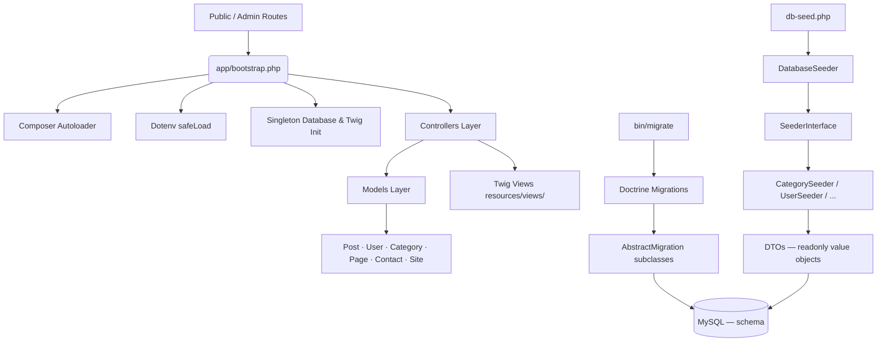
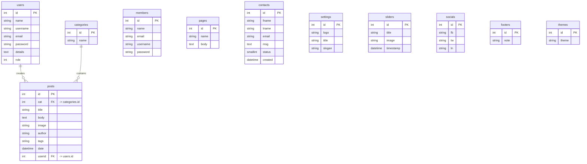

# 🚀 Nexus CMS — PHP Blog Engine

[](https://www.php.net/)
[](https://packagist.org/packages/vlucas/phpdotenv)
[](https://www.doctrine-project.org/projects/migrations.html)
[](LICENSE)

A lightweight, robust, Object-Oriented PHP blogging engine and content management system. Built using a modern **MVC (Model-View-Controller)** architecture, **Twig** templating, **Tailwind CSS** for styling, a clean Singleton MySQLi wrapper, Doctrine Migrations for schema versioning, and a fully typed DTO-driven seeder system.

Designed for speed, ease of configuration, and flexibility, **Nexus CMS** serves as a production-ready starting template for custom PHP web applications or a showcase of modern OOP PHP design patterns.

---

## 🌟 Key Features

### 🖥️ Public Site
*   **Dynamic Post Stream:** Paginated feeds of blog posts with categories, taglines, and rich read-more details.
*   **Flexible Category Navigation:** Automatically generated category menus filtering relevant posts.
*   **Search System:** Search through post content and titles with sanitization.
*   **Contact Portal:** Secure contact form that processes user inquiries directly to the administrative inbox.
*   **Custom Pages:** Admin-defined static pages (e.g., About Us, Privacy Policy) rendered dynamically.

### 🛡️ Admin Dashboard (`/admin`)
*   **Full Blog Post CRUD:** Author, edit, delete, and view posts complete with image uploading.
*   **Category Management:** Add, update, and manage taxonomy.
*   **Dynamic Slider Controller:** Configure home-page sliders and promotional carousels.
*   **Custom Page Builder:** Add new pages and update content without touching the codebase.
*   **Central Inbox:** Read and reply directly to incoming inquiries sent via the frontend contact form.
*   **Site Settings Control:** Real-time updates for site titles, descriptions, SEO metadata, slogans, and copyright tags.
*   **User & Session Management:** Access controls, password resetting, and user profiles with multi-tier role authorization.

---

## 🛠️ Technology Stack

| Layer | Technology |
|-------|-----------|
| Runtime | PHP 8.0+ — OOP MVC Architecture, PSR-4 autoloading |
| Frontend | Twig Templating Engine & Tailwind CSS v3 |
| Rich Text | Jodit Editor (Open Source, MIT) |
| Database | MySQL / MariaDB |
| App DB layer | Singleton `mysqli` wrapper (`app/Core/Database.php`) |
| Migrations | Doctrine Migrations 3.x + Doctrine DBAL 3.x |
| Seeder | PDO prepared statements, DTO value objects |
| Environment | `vlucas/phpdotenv` |
| CLI | Symfony Console (bundled with Doctrine Migrations) |
| Web Server | Apache/Laragon (`.htaccess`) or `php -S` |
| Security | OWASP Top 10 enforced — see [Security Practices](#-security-practices) |

---

## 🏗️ Architecture & Core Components



### 💾 Core Classes

| Class | Path | Responsibility |
|-------|------|----------------|
| `Database` | `app/Core/Database.php` | Singleton `mysqli` wrapper — one connection per request |
| `Session` | `app/Core/Session.php` | Auth checks, flash messages, session lifecycle |
| `Format` | `app/Helpers/Format.php` | Content sanitization, text trimming |
| `dump()` | `app/Helpers/Debug.php` | Development dump helper — renders variable, last PHP error, `$_GET`/`$_POST`/`$_SERVER` in a styled card (loaded only when `APP_ENV=development`) |

### 🏷️ Models

Models map domain logic and database operations, keeping script files clean:

| Model | Table | Key Methods |
|-------|-------|-------------|
| `Post` | `posts` | `getPaginated`, `getById`, `search`, `create`, `update`, `delete` |
| `Category` | `categories` | `getAll`, `getById`, `create`, `update`, `delete` |
| `User` | `users` | `getByUsername`, `create`, `update`, `delete` |
| `Page` | `pages` | `getByName`, `create`, `update` |
| `Contact` | `contacts` | `getAll`, `create`, `markRead` |
| `Site` | `settings` | `getInfo`, `getAllSiteInfo`, `getSiteInfoById` |

### 🗄️ Database Layer (`app/Database/`)

**Entity Relationship Diagram (ERD)**



**Migrations** — Schema versioning via Doctrine Migrations 3.x:

| File | Class | Creates |
|------|-------|---------|
| `2026_07_04_000003_create_contacts_table.php` | `CreateContactsTable` | `contacts` |
| `2026_07_04_000004_create_footers_table.php` | `CreateFootersTable` | `footers` |
| `2026_07_04_000005_create_pages_table.php` | `CreatePagesTable` | `pages` |
| `2026_07_04_000006_create_settings_table.php` | `CreateSettingsTable` | `settings` |
| `2026_07_04_000007_create_sliders_table.php` | `CreateSlidersTable` | `sliders` |
| `2026_07_04_000008_create_categories_table.php` | `CreateCategoriesTable` | `categories` |
| `2026_07_04_000009_create_users_table.php` | `CreateUsersTable` | `users` |
| `2026_07_04_000010_create_socials_table.php` | `CreateSocialsTable` | `socials` |
| `2026_07_04_000011_create_posts_table.php` | `CreatePostsTable` | `posts` |
| `2026_07_04_000012_create_themes_table.php` | `CreateThemesTable` | `themes` |
| `2026_07_04_000013_create_members_table.php` | `CreateMembersTable` | `members` |

**Seeders** — Fully typed, DTO-driven population system:

| Class | Path | Responsibility |
|-------|------|----------------|
| `SeederInterface` | `app/Database/SeederInterface.php` | Contract every seeder must implement |
| `DatabaseSeeder` | `app/Database/DatabaseSeeder.php` | Orchestrator — truncates tables, calls all seeders in dependency order |
| **DTOs** | `app/Database/DTOs/` | Immutable `readonly` value objects — one per table |
| **Seeders** | `app/Database/Seeders/` | Concrete implementations using DTOs + PDO prepared statements |

Seeder execution order (respects FK constraints):
`categories → users → members → posts → pages → sliders → settings → socials → footers → themes → contacts`

---

## 📂 Directory Structure

```text
├── admin/                          # Legacy admin entry points (wrappers)
│   ├── index.php                   # Routes to Admin\DashboardController
│   └── ...                         # Other routed scripts
├── resources/                      # Frontend and UI
│   └── views/                      # Twig Templates
│       ├── frontend/               # Public facing views
│       └── dashboard/              # Admin dashboard views
├── app/                            # OOP core & business logic
│   ├── Contracts/                  # Interfaces defining model and service contracts
│   ├── Controllers/                # MVC Controllers (Admin & Frontend)
│   ├── Core/                       # Singleton DB & session handling
│   │   ├── Database.php
│   │   └── Session.php
│   ├── Database/                   # Database layer
│   │   ├── DTOs/                   # Immutable value objects (one per table)
│   │   │   └── CategoryDTO.php · ContactDTO.php · ... (11 total)
│   │   ├── Migrations/             # Doctrine migration files (Laravel-style names)
│   │   │   ├── 2026_07_04_000003_create_contacts_table.php
│   │   │   ├── 2026_07_04_000006_create_settings_table.php
│   │   │   └── ... (11 migrations total)
│   │   ├── Seeders/                # Concrete seeder implementations
│   │   │   └── CategorySeeder.php · UserSeeder.php · ... (11 total)
│   │   ├── DatabaseSeeder.php      # Master seeder orchestrator
│   │   └── SeederInterface.php     # Seeder contract
│   ├── Helpers/                    # Utility helpers
│   │   ├── Debug.php               # dump() — dev-only debug helper
│   │   └── Format.php              # Content sanitization & formatting
│   ├── Models/                     # Database-mapped PHP classes implementing Contracts
│   │   └── Post.php · User.php · Category.php · ... (6 total)
│   ├── Security/                   # Security handlers (e.g. InputValidator)
│   ├── Services/                   # Business logic services (e.g. FileUploader)
│   └── bootstrap.php               # App entry bootstrap & dependency injection
├── bin/                            # CLI entry points
│   ├── make-migration              # Generate Laravel-style migration file
│   ├── make-model                  # Generate Model class (+ optional migration)
│   └── migrate                     # Doctrine Migrations CLI runner
├── config/                         # Static configuration loader
├── css/                            # Frontend styles
├── js/                             # Frontend scripts
├── vendor/                         # Composer vendor packages
├── .agents/                        # Agent rules & project conventions
│   └── AGENTS.md                   # OWASP rules, coding standards
├── .env                            # Active environment (never commit)
├── .env.example                    # Environment configuration template
├── .gitignore                      # Files excluded from version control
├── composer.json                   # Composer config & script shortcuts
├── db-seed.php                     # CLI entry point — runs DatabaseSeeder
└── migrations.php                  # Doctrine Migrations config (pure PHP array)
```

---

## ⚙️ Installation & Setup

### Prerequisites
*   **PHP:** v8.0 or higher
*   **Composer:** For managing dependencies
*   **Database:** MySQL / MariaDB

### Steps

1. **Clone the Repository**
   ```bash
   git clone https://github.com/mhannan-dev/php-blog.git
   cd php-blog
   ```

2. **Install Dependencies**
   ```bash
   composer install
   ```

3. **Configure Environment Variables**
   ```bash
   cp .env.example .env
   ```
   Open `.env` and fill in your credentials:
   ```ini
   DB_HOST=localhost
   DB_USER=root
   DB_PASS=your_db_password
   DB_NAME=blg
   APP_ENV=development

   TITLE="Nexus CMS"
   META_DESC="A blog developed by Muhammad Hannan using PHP & MySQL."
   KEYWORDS="PHP, Laravel, Vue JS, WordPress, plugin"
   ```

4. **Create the Database Schema (Migrations)**
   ```bash
   composer migrate
   ```
   This runs all Doctrine Migrations in order, creating all 11 application tables.

5. **Seed the Database**
   ```bash
   composer db:seed
   ```
   Runs the full `DatabaseSeeder` pipeline — truncates all tables and populates them with sample data using typed DTOs and PDO prepared statements.

6. **Start the Local Development Server**
   ```bash
   composer start
   php -S localhost:8888

   ```
   App runs at **`http://localhost:8888`**.

---

## ⌨️ Composer CLI Scripts

All project operations are available as Composer shortcuts:

### 🗄️ Migrations

| Command | Description |
|---------|-------------|
| `composer migrate` | Apply all pending migrations |
| `composer migrate:status` | Show applied / pending migration versions |
| `composer migrate:gen` | Generate a blank Doctrine migration class |
| `composer migrate:diff` | Generate migration from schema diff |
| `composer migrate:down` | Roll back all applied migrations |

### 🏗️ Code Generators

| Command | Description |
|---------|-------------|
| `composer make:migration create_posts_table` | Generate a Laravel-style migration file |
| `composer make:model Post` | Generate a Model class |
| `composer make:model Post -- -m` | Generate a Model **and** its migration |

**Migration naming convention** (identical to Laravel):

```
YYYY_MM_DD_HHMMSS_action_description.php  →  class ActionDescription
```

Examples:
```bash
composer make:migration create_orders_table         # → CreateOrdersTable
composer make:migration add_published_at_to_posts   # → AddPublishedAtToPosts
composer make:migration drop_themes_table           # → DropThemesTable
```

**Model name → table name** (auto-derived):

| Model name | Table |
|------------|-------|
| `Post` | `posts` |
| `Category` | `categories` |
| `ProductCategory` | `product_categories` |

### 🌱 Seeding

| Command | Description |
|---------|-------------|
| `composer db:seed` | Truncate all tables and re-seed with sample data |

### 🚀 Development

| Command | Description |
|---------|-------------|
| `composer start` | Start PHP built-in server on `localhost:8888` |

---

## 🔐 Security Practices

This project follows the **OWASP Top 10** guidelines as hard requirements. Key practices enforced throughout the codebase:

| # | Risk | Mitigation |
|---|------|------------|
| A01 | Broken Access Control | Server-side role checks on every admin route; least-privilege model |
| A02 | Cryptographic Failures | `password_hash()` / `password_verify()` (bcrypt); secrets in `.env` only |
| A03 | Injection | PDO prepared statements with bound parameters; `htmlspecialchars()` on all output |
| A04 | Insecure Design | Defense-in-depth; rate limiting on login and contact form |
| A05 | Security Misconfiguration | `display_errors=Off` in production; `.env`/`.git` denied via `.htaccess`; `HttpOnly`+`SameSite` cookies |
| A06 | Vulnerable Components | MIT-licensed deps only; version-pinned in `composer.json` |
| A07 | Auth Failures | `session_regenerate_id(true)` on login; account lockout after repeated failures |
| A08 | Integrity Failures | CSP headers; no unsafe deserialization |
| A09 | Logging & Monitoring | Auth events logged with timestamp + IP; logs outside webroot |
| A10 | SSRF | URL allowlist; internal IP ranges blocked for any outbound HTTP |

---

## 👨‍💻 Author

**Muhammad Hannan**
📧 Email: [mdhannan.info@gmail.com](mailto:mdhannan.info@gmail.com)
🌐 GitHub: [@mhannan-dev](https://github.com/mhannan-dev)

---

## 📄 License

This project is licensed under the MIT License — see the [LICENSE](LICENSE) file for details.
