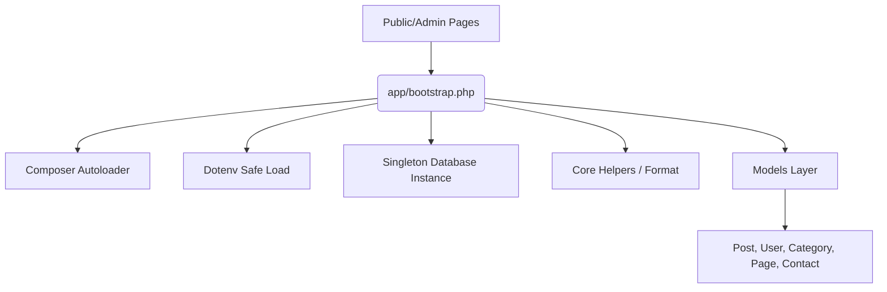

# 🚀 MH CMS — Raw PHP OOP Blog Engine

[](https://www.php.net/)
[](https://packagist.org/packages/vlucas/phpdotenv)
[](LICENSE)

A lightweight, robust, and custom Object-Oriented PHP blogging engine and content management system. Built using raw PHP OOP principles, standard MySQLi connections wrapped in a clean Singleton wrapper, and dynamic Model-driven layers. 

Designed for speed, ease of configuration, and flexibility, **MH CMS** serves as a production-ready starting template for custom PHP web applications or a showcase of pure OOP PHP design patterns.

---

## 🌟 Key Features

### 🖥️ Public Site
*   **Dynamic Post Stream:** Paginated feeds of blog posts with categories, taglines, and rich read-more details.
*   **Flexible Category Navigation:** Automatically generated category menus filtering relevant posts.
*   **Search System:** Search through post content and titles with sanitization.
*   **Contact Portal:** Secure contact form that processes user inquiries directly to the administrative inbox.
*   **Custom Pages:** Admin-defined static pages (e.g., About Us, Privacy Policy) rendered dynamically.

### 🛡️ Admin Dashboard (`/admin`)
*   **Full Blog Post CRUD:** Author, edit, delete, and view posts complete with image uploading.
*   **Category Management:** Add, update, and manage taxonomy.
*   **Dynamic Slider Controller:** Configure home-page sliders and promotional carousels.
*   **Custom Page Builder:** Add new pages and update content without touching the codebase.
*   **Central Inbox:** Read and reply directly to incoming inquiries sent via the frontend contact form.
*   **Site Settings Control:** Real-time updates for site titles, descriptions, SEO metadata, slogans, and copyright tags.
*   **User & Session Management:** Access controls, password resetting, and user profiles with multi-tier role authorization.

---

## 🛠️ Technology Stack

*   **Runtime:** [PHP](https://www.php.net/) (OOP architecture, PSR-4 Autoloading)
*   **Database:** MySQL (using native `mysqli` with parameterized/safe queries via Singleton wrapping)
*   **Dependencies:** `vlucas/phpdotenv` for secure environmental variables management
*   **Web Server:** Built-in PHP development server support or standard Apache/Laragon configurations via `.htaccess` redirection

---

## 🏗️ Architecture & Core Components

This application utilizes a custom **Model-Driven Architecture** centered around a single entry point bootstrapping cycle:



### 💾 Core Classes
1.  **[Database.php](file:///E:/laragon/www/php-blog/app/Core/Database.php):** Implements the Singleton pattern. Ensures exactly one database connection is reused during execution, wrapping the `mysqli` driver with safe connection details and UTF-8 charset validation.
2.  **[Session.php](file:///E:/laragon/www/php-blog/app/Core/Session.php):** Simplifies cookie/session handling. Responsible for authorization checks, flash messages, and tracking user credentials across subdirectories.
3.  **[Format.php](file:///E:/laragon/www/php-blog/app/Helpers/Format.php):** Implements helpers for content formatting, sanitization, and text trimming (e.g., body truncation).

### 🏷️ Models
Models map domain logic and database operations, keeping script files clean:
*   **`Post`**: Handles retrieving, inserting, and editing articles.
*   **`Category`**: Manages categories and category counts.
*   **`User`**: Handles authentication and account management.
*   **`Page`**: Fetches and stores custom page markdown/HTML.
*   **`Contact`**: Saves contact messages and controls inbox queues.

---

## 📂 Directory Structure

```text
├── admin/                  # Fully featured CMS dashboard
│   ├── index.php           # Admin Dashboard landing
│   ├── login.php           # Admin authentication
│   └── post_list.php       # Post catalog & action handlers
├── app/                    # OOP Core & Business Logic
│   ├── Core/               # Singleton DB & Session handling
│   ├── Helpers/            # Helper utilities (formatting, escaping)
│   ├── Models/             # Database-mapped PHP classes
│   └── bootstrap.php       # App entry bootstrap
├── config/                 # Static configuration loader
├── css/                    # Frontend styles
├── js/                     # Frontend interactive scripts
├── vendor/                 # Composer vendor packages (e.g. phpdotenv)
├── .env.example            # Environment configuration template
├── composer.json           # Composer configuration & scripts
└── db_blg.sql              # Database structure & default content seeding
```

---

## ⚙️ Installation & Setup

### Prerequisites
*   **PHP:** v8.0 or higher
*   **Composer:** For managing dependencies
*   **Database:** MySQL / MariaDB

### Steps

1.  **Clone the Repository**
    ```bash
    git clone https://github.com/mhannan-dev/php-blog.git
    cd php-blog
    ```

2.  **Install Dependencies**
    ```bash
    composer install
    ```

3.  **Setup the Database**
    *   Create a MySQL database (e.g., `blog_cms`).
    *   Import the database schema and seed data using the provided `db_blg.sql` file:
        ```bash
        mysql -u your_username -p blog_cms < db_blg.sql
        ```

4.  **Configure Environment Variables**
    *   Copy the `.env.example` file to `.env`:
        ```bash
        cp .env.example .env
        ```
    *   Open `.env` and fill in your database credentials and configurations:
        ```ini
        DB_HOST=localhost
        DB_USER=root
        DB_PASS=your_db_password
        DB_NAME=blog_cms
        APP_ENV=development
        
        TITLE="MH CMS"
        META_DESC="A blog developed by Muhammad Hannan using PHP & MySQL."
        KEYWORDS="PHP, Laravel, Vue JS, WordPress, plugin"
        ```

5.  **Start the Local Development Server**
    You can spin up the built-in PHP local web server using the configured Composer script:
    ```bash
    composer start
    ```
    The application will now be running at **`http://localhost:8888`**.

---

## 👨‍💻 Author

**Muhammad Hannan**  
📧 Email: [mdhannan.info@gmail.com](mailto:mdhannan.info@gmail.com)  
🌐 Website / GitHub: [@mhannan-dev](https://github.com/mhannan-dev)

---

## 📄 License

This project is licensed under the MIT License — see the [LICENSE](LICENSE) file for details.
